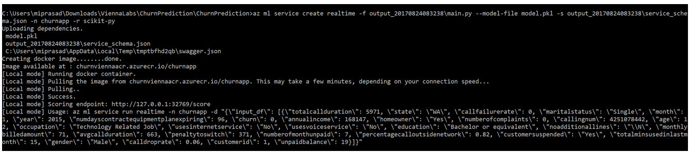
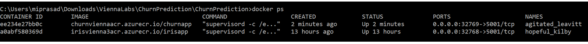

# Churn Prediction using AMLWorkbench - Operationalization

## 1. Objectives

The aim of this lab is to publish churn models and code as web services so that they can be consumed to produce business results.

## 2. Setup

Local mode deployments run in docker containers on your local computer, whether that is your personal machine or a VM running on Azure. You can use local mode for development and testing.
To prepare the operationalization environment, in the CLI window type the following to set up the environment for local operationalization:

```
az ml env setup -n <envname> -g <resourcegroup> -l <resourceslocation>
```

Follow the instructions to provision an Azure Container Registry (ACR) instance and a storage account in which to store the Docker image we are about to create. When finished, a file named .amlenvrc.cmd is created in your home directory (usually C:\Users<username>) which contains then names and credentials of the ACR and storage account.

To set the environment variables required for operationalization, execute the .amlenvrc.cmd file from the command line.

```
c:\Users\<username>\.amlenvrc.cmd
```

To verify that you have properly configured your operationalization environment for local web service deployment, enter the following command:

```
az ml env local
```

## 3. Scoring and Schema Files

Open churn_schema_gen.py. Churn_schema_gen.py is responsible for generating the scoring and schema files necessary to operationalize Churn Prediction. Prepare the web service definition by authoring init() and run() functions.
The init() function loads the model (model.pkl) as shown below:
```
def init():
    from sklearn.externals import joblib

    # load the model file
    global model
    model = joblib.load('model.pkl')
```
The run() function takes the input dataframe, input_df and performs one-hot encoding. Columns_encoded is the list of all columns after encoding from the modeling exercise and the encoded dataframe is passed to the model for prediction. The three columns year, month and churn (class) are also deleted to be consistent with the preprocessing performed with the modeling.
```
def run(input_df):
    import json
    input_df_encoded = input_df

    input_df_encoded = input_df_encoded.drop('year', 1)
    input_df_encoded = input_df_encoded.drop('month', 1)
    input_df_encoded = input_df_encoded.drop('churn', 1)
    
    columns_encoded = ['age', 'annualincome', 'calldroprate', 'callfailurerate', 'callingnum',
       'customerid', 'monthlybilledamount', 'numberofcomplaints',
       'numberofmonthunpaid', 'numdayscontractequipmentplanexpiring',
       'penaltytoswitch', 'totalminsusedinlastmonth', 'unpaidbalance',
       'percentagecalloutsidenetwork', 'totalcallduration', 'avgcallduration',
       'churn', 'customersuspended_No', 'customersuspended_Yes',
       'education_Bachelor or equivalent', 'education_High School or below',
       'education_Master or equivalent', 'education_PhD or equivalent',
       'gender_Female', 'gender_Male', 'homeowner_No', 'homeowner_Yes',
       'maritalstatus_Married', 'maritalstatus_Single', 'noadditionallines_\\N',
       'occupation_Non-technology Related Job', 'occupation_Others',
       'occupation_Technology Related Job', 'state_AK', 'state_AL', 'state_AR',
       'state_AZ', 'state_CA', 'state_CO', 'state_CT', 'state_DE', 'state_FL',
       'state_GA', 'state_HI', 'state_IA', 'state_ID', 'state_IL', 'state_IN',
       'state_KS', 'state_KY', 'state_LA', 'state_MA', 'state_MD', 'state_ME',
       'state_MI', 'state_MN', 'state_MO', 'state_MS', 'state_MT', 'state_NC',
       'state_ND', 'state_NE', 'state_NH', 'state_NJ', 'state_NM', 'state_NV',
       'state_NY', 'state_OH', 'state_OK', 'state_OR', 'state_PA', 'state_RI',
       'state_SC', 'state_SD', 'state_TN', 'state_TX', 'state_UT', 'state_VA',
       'state_VT', 'state_WA', 'state_WI', 'state_WV', 'state_WY',
       'usesinternetservice_No', 'usesinternetservice_Yes',
       'usesvoiceservice_No', 'usesvoiceservice_Yes']
    
    for column_encoded in columns_encoded:
        if not column_encoded in input_df.columns:
            input_df_encoded[column_encoded] = 0

    columns_to_encode = ['customersuspended', 'education', 'gender', 'homeowner', 'maritalstatus', 'noadditionallines', 'occupation', 'state', 'usesinternetservice', 'usesvoiceservice']
    for column_to_encode in columns_to_encode:
        dummies = pandas.get_dummies(input_df[column_to_encode])
        one_hot_col_names = []
        for col_name in list(dummies.columns):
            one_hot_col_names.append(column_to_encode + '_' + col_name)
            input_df_encoded[column_to_encode + '_' + col_name] = 1
        input_df_encoded = input_df_encoded.drop(column_to_encode, 1)
    
    pred = model.predict(input_df_encoded)
    return json.dumps(str(pred[0]))
```

## 4. Realtime Web Service

To deploy the web service, you must have a model, a scoring script, and optionally a schema for the web service input data. The scoring script loads the model.pkl file from the current folder and uses it to produce a new predicted class. The input to the model is encoded features.

To generate the scoring and schema files, execute the churn_schema_gen.py file that comes with the sample project in the AMLWorkbench CLI command prompt using Python interpreter directly.

```
python churn_schema_gen.py
```

This will create service_schema.json (this file contains the schema of the web service input)

### Model Management

The real-time web service requires a modelmanagement account. This can be created using the following commands:
```
az group create -l <location> -n <name>
az ml account modelmanagement create -l <location> -g <resource group> -n <account name>
az ml account modelmanagement set -n <account name> -g <resource group>
```

To create the real-time web service, run the following command:

```
az ml service create realtime -f score.py --model-file model.pkl -s service_schema.json -n <name> -r python
```




The different az ml service create realtime command parameters are as follows:
* -n: app name, must be lower case.
* -f: scoring script file name
* --model-file: model file, in this case it is the pickled sklearn model
* -r: type of model, in this case it is the scikit-learn model
The model and the scoring file are uploaded into an Azure service that we manage. As part of deployment process, the operationalization component uses the pickled model model.pkl and main.py to build a Docker image named <ACR_name>.azureacr.io/irisapp. It registers the image with your Azure Container Registry (ACR) service, pulls down that image locally to your computer, and starts a Docker container based on that image. As part of the deployment, an HTTP REST endpoint for the web service is created on your local machine.

Run docker ps to see the churn image as shown below:



To test the service, execute the returned service run command as follows. For example, the command that is run below is:

```
az ml service run realtime -i churnapp1 -d "{\"input_df\": [{\"annualincome\": 168147, \"usesvoiceservice\": \"No\", \"usesinternetservice\": \"No\", \"noadditionallines\": \"\\N\", \"churn\": 0, \"occupation\": \"Technology Related Job\", \"month\": 1, \"customerid\": 1, \"year\": 2015, \"numdayscontractequipmentplanexpiring\": 96, \"numberofmonthunpaid\": 7, \"calldroprate\": 0.06, \"penaltytoswitch\": 371, \"monthlybilledamount\": 71, \"totalminsusedinlastmonth\": 15, \"education\": \"Bachelor or equivalent\", \"numberofcomplaints\": 0, \"unpaidbalance\": 19, \"totalcallduration\": 5971, \"state\": \"WA\", \"callfailurerate\": 0, \"callingnum\": 4251078442, \"homeowner\": \"Yes\", \"maritalstatus\": \"Single\", \"customersuspended\": \"Yes\", \"gender\": \"Male\", \"percentagecalloutsidenetwork\": 0.82, \"age\": 12, \"avgcallduration\": 663}]}"
```


## 5. Exercise

Can you create a similar service for the Naïve Bayes model?
