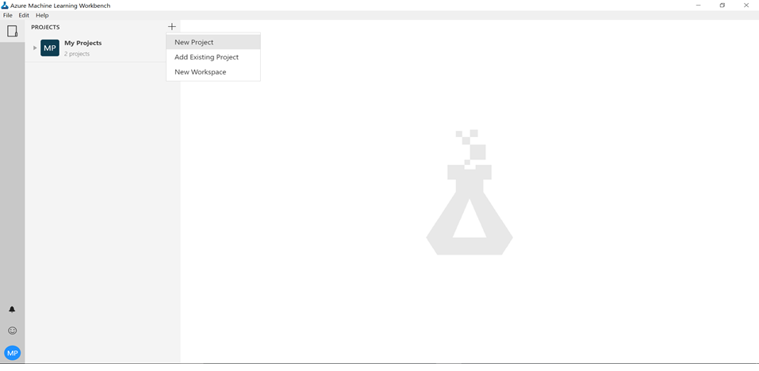
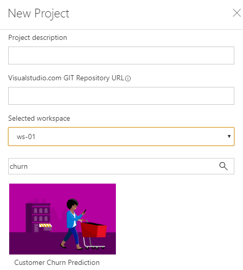
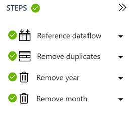

# Churn Prediction using AMLWorkbench - Data Preparation

## 1. Objectives

The aim of this lab is to understand how AMLWorkbench’s Data Preparation tools can be used to clean and ingest customer relationship data for churn analytics.

The dataset used to ingest is from SIDKDD 2009 competition. The dataset consists of heterogeneous noisy data (numerical/categorical variables) from French Telecom company Orange and is anonymized.

## 2. Setup

2.1. Begin the lab by creating a New Project by selecting the plus sign from Recent Projects.

2.2. Provide a project name, project directory and select a blank project template as next steps. For the project directory, create a new directory for churn analytics and copy the path to project directory in the wizard.

## 3. Data Source

Data Preparation is part of the AMLWorkbench client experience and installed with it. AMLWorkbench desktop application, offers an intuitive and powerful ML-based data preparation experience built on the PROSE (PROgram Synthesis using Example) technology.

PROSE is a framework of technologies for programming by examples – automatic generation of programs from input-output examples at runtime. PROSE includes a pre-defined suite of technologies for various kinds of data wrangling – cleaning and pre-processing raw semi-structure data into a form amenable to analysis.

3.1. Select Data Sources and click the + sign to add Data Source.

3.2. In the Add Data Source wizard, select File and provide the path of the local file CATelcoCustomerChurnTrainingSample.csv. This file is in the data folder.

3.3. In the File Details part of Add Data Source wizard, leave all the default options as is. You will be able to preview the data import:

3.4. In the Data Types part of Add Data Source wizard, notice how all the numeric fields are shown with the Type: Number. If no type is specified, string is assumed. Hence, you do not need to add the type for all the categorical features.

3.5. In the Sampling part of Add Data Source wizard, select sample: “Full File” and leave all other options default. AMLWorkbench allows users to have multiple samples per data source. The Active indicator lets the user choose which sample to use when displaying the data source.

3.6. Once the data source is created, select Prepare and create a .dprep (a data preparation package). Name the .dprep file CATelcoCustomerChurnTrainingSample.dprep. Double click the .dprep file to open it to perform data cleansing.

## 4. Data Cleansing

4.1. Select the full dataset and then Transforms->Remove Duplicates to eliminate duplicate copies of repeating data.

4.2. We can get rid of year and month fields from our dataset as they intuitively do not make sense to include in our dataset. Select the year column first and then Transforms->Remove Column. Similarly, remove the month column.

4.3. ***Optional:*** The concept of missing values is important to understand in order to successfully manage data. If the missing values are not handled properly, the predictive models can be inaccurate. Handling missing values with AMLWorkbench is simple. Missing values are very specific to each field as the field types can be different. By selecting the full dataset and then Transforms -> Replace Missing Values, you will be able to replace missing values for each field.

4.4. After following all the above steps, the summary steps should look like the below image. Note that in the Replace missing values step, all the column names are displayed as we want this to apply on the full dataset. Additionally, a .dprep file would be created which can be used to create a data frame (details in next lab).

[Go to next hands-on lab](https://github.com/Azure/MachineLearningSamples-ChurnPrediction/blob/master/docs/ModelingAndEvaluation.md)
